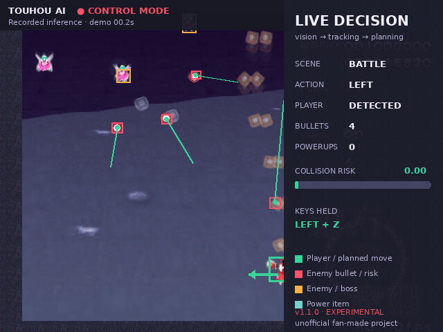

<div align="center">

<h1>Touhou AI</h1>

<p><strong>基于 YOLO 目标检测与规则决策的《东方红魔乡》自动操作实验</strong></p>

<p>
  
  
  
  
  
</p>

<p>
  <a href="#快速开始">快速开始</a> ·
  <a href="#当前表现">当前表现</a> ·
  <a href="#第一次使用">第一次使用</a> ·
  <a href="#模型">模型</a> ·
  <a href="#文档">项目文档</a>
</p>

</div>

Touhou AI 从游戏窗口实时截图，使用 YOLO 检测自机、敌弹、敌人和道具，再由
规则控制器生成移动、射击和 Bomb 输入。项目提供桌面 GUI，也可以先在不发送
任何按键的情况下查看检测结果和计划动作。

> [!IMPORTANT]
> 这是非官方的二次创作技术实验，与上海爱丽丝幻乐团、ZUN 或东方 Project
> 官方无关，也未获得其认可或赞助。仓库不提供游戏本体。

<p align="center">
  
</p>

<p align="center">
  <em>一次 AI Control 模式会话回放：检测框、弹道预测、碰撞风险与执行动作。</em>
</p>

## 主要功能

| | 功能 | 说明 |
|---|---|---|
| 🧠 | 实时视觉控制 | YOLO/PyTorch 检测画面，规则控制器实时规划动作 |
| 👁️ | Safe Observation | 使用相同的检测、跟踪和规划流程，但禁止键鼠事件 |
| 🎮 | AI Control | 控制移动、射击与有限的自动 Bomb，并持续确认游戏焦点 |
| 🛡️ | 安全保护 | 窗口失焦、自机丢失或场景不确定时立即释放全部按键 |
| 📈 | 轨迹与风险 | 跟踪敌弹速度、预测碰撞风险并比较八方向移动路径 |
| 🎞️ | 会话复盘 | 保存抽样画面、动作和风险数据，支持报告与审核数据导出 |

桌面控制中心提供以下页面：

- `Control`：启动观察或正式控制，查看组件状态并调整运行参数
- `Sessions`：浏览历史会话、抽样画面和分析结果
- `Live Log`：集中查看运行状态与错误信息
- `Tools`：环境检查、回归测试、模型评估和记录目录
- `About`：版本定位、安全边界和已知限制

## 当前表现

v1.1.0 已能连续执行截图、检测、规则决策和按键输入。在当前测试环境中，控制器
曾完成基本移动和射击、回到场地中部、收集部分 Power 道具，并运行到第一面
Boss。

这个版本仍然是实验性原型，目前不能稳定完成第一关：

- 识别精度尚未通过标准化人工验证集量化
- 密集 Boss 弹幕仍可能超过当前局部规划能力
- 激光没有独立标注，无法获得和普通敌弹同等级的建模
- 菜单、续关和关卡切换尚未形成完整自动状态机
- 生存效果会受到分辨率、窗口缩放、游戏版本和推理速度影响

当前版本不再继续微调控制参数。若以后重新开发，更合理的方向是整理标注数据、
补充激光与特殊弹幕类别，并采用可离线验证的新控制方法。

## 快速开始

### 1. 准备环境

目前仅支持 **Linux X11**。Wayland、Windows 原生运行和 macOS 尚未适配。

需要：

- Python 3.10 或更高版本
- Wine
- `xdotool` 与 `xwininfo`
- Tkinter
- CPU，或兼容当前 PyTorch 的 NVIDIA GPU

Ubuntu/Debian 系统组件：

```bash
sudo apt install python3-venv python3-tk wine xdotool x11-utils
```

### 2. 获取项目

```bash
git clone https://github.com/wcycn/touhou_ai.git
cd touhou_ai

python3 -m venv .venv
source .venv/bin/activate
python -m pip install --upgrade pip
python -m pip install -r requirements.txt
```

### 3. 获取模型

模型权重由 Hugging Face 托管，不再包含在 GitHub 源码仓库中。首次启动 Safe
Observation 或 AI Control 时，程序会自动下载约 22.5 MB 的权重到
`models/best.pt`，并在加载前校验 SHA-256。

也可以提前通过 GUI 的 **Tools → Download / Verify YOLO Model** 下载，或运行：

```bash
python3 touhou_ai.py model
```

模型页面：[wcycn/touhou-ai-yolo](https://huggingface.co/wcycn/touhou-ai-yolo)

### 4. 放置游戏

将你合法取得的《东方红魔乡》完整游戏文件复制到 `game/`，保持原目录结构。
详细说明见 [`game/README.md`](game/README.md)。

启动器依次寻找：

1. `vpatch.exe`
2. `th06c.exe`
3. `th06.exe`
4. `東方紅魔郷.exe`

游戏文件已被 `.gitignore` 排除，不会随普通 Git 提交上传。

### 5. 启动控制中心

```bash
python3 touhou_ai.py gui
```

也可以双击 `启动控制中心.sh`。

## 第一次使用

建议按以下顺序进行：

1. 在 `Control` 页面点击 **Launch game (vpatch)**。
2. 手动进入一个关卡，并让游戏保持窗口模式。
3. 点击 **Check game window**，确认日志中的截图区域正确。
4. 启动 **Safe Observation**，观察识别框和 AI 判断约 30 秒。
5. 停止观察后运行 **Test left / right input**。
6. 确认人物能够短暂移动，再点击 **Start AI Control**。

> [!CAUTION]
> AI Control 会持续把焦点切回游戏并发送真实键盘事件。切换到其他程序前，请先
> 点击 **STOP AI AND RELEASE ALL KEYS**。紧急情况下也可以把鼠标快速移动到
> 屏幕角落，触发 PyAutoGUI failsafe。

推荐从默认的 `defensive` 模式和 `0.15` 检测置信度开始。Safe Observation 与
AI Control 使用同一套识别、跟踪和规划逻辑，二者只在是否允许执行输入上不同。

## 工作方式

```text
Wine 游戏窗口
      ↓
MSS 实时截图
      ↓
YOLO / PyTorch 目标检测
      ↓
自机与敌弹跟踪 · 碰撞风险预测
      ↓
八方向规则规划 · 道具与攻击决策
      ↓
焦点确认 · 差分按键状态机
      ↓
PyAutoGUI 游戏输入
```

推理设备会在启动时自动检查。如果当前 PyTorch 不支持显卡架构，程序会明确说明
原因并回退到 CPU，而不是静默输出空检测。

## 运行数据

项目不依赖在线大模型接口。会话、截图、设置和分析结果默认保存在项目内部：

| 内容 | 路径 |
|---|---|
| YOLO 权重本地缓存 | `models/best.pt` |
| 本机游戏 | `game/` |
| 本机数据集 | `datasets/` |
| GUI 设置 | `settings.json` |
| 会话与抽样画面 | `sessions/` |
| 日志与评估输出 | `runs/` |

这些本地运行数据默认不会进入 Git 仓库。

## 模型

当前发布模型是一个用于项目截图管线的 21 类 Ultralytics YOLO 检测器：

- 仓库：[Hugging Face · wcycn/touhou-ai-yolo](https://huggingface.co/wcycn/touhou-ai-yolo)
- 文件：`best.pt`
- 输入尺寸：640
- SHA-256：`78eb395d277bb5f35f27025a7bada7725928d6e7f7b15681f659a43b5bf60ab2`
- 训练数据备份：[Hugging Face · wcycn/touhou-ai-dataset](https://huggingface.co/datasets/wcycn/touhou-ai-dataset)（私人仓库，仅所有者可访问）

Hugging Face 模型卡包含完整类别表、训练数据规模、使用示例和限制。原始训练
截图只保存在私人 Dataset 仓库中，没有公开发布。

<details>
<summary><strong>命令行与分析工具</strong></summary>

日常使用推荐 GUI；下面的命令主要用于诊断和离线分析。

```bash
# 检查文件、依赖、X11 工具和推理设备
python3 touhou_ai.py check

# 运行不会启动游戏或发送按键的回归测试
python3 touhou_ai.py test

# 列出窗口候选并显示最终截图区域
python3 touhou_ai.py locate

# 运行检测、跟踪和规划流程，但禁止一切键鼠输入
python3 touhou_ai.py observe

# 启动正式控制
python3 touhou_ai.py ai --mode defensive

# 分析最新会话
python3 touhou_ai.py analyze

# 导出需要人工审核的画面与 YOLO 预标注
python3 touhou_ai.py analyze --export-review

# 使用人工标注的验证集评估模型
python3 touhou_ai.py model-eval datasets/validation/data.yaml
```

</details>

## 文档

- [当前能力与发布边界](docs/PROJECT_STATUS.md)
- [架构与输入安全设计](docs/ARCHITECTURE.md)
- [开发路线与验收目标](docs/ROADMAP.md)
- [v1.1.0 发行说明](docs/RELEASE_NOTES_v1.1.0.md)
- [版本变更记录](CHANGELOG.md)

## 官方相关链接

- [上海爱丽丝幻乐团官方网站](http://www16.big.or.jp/~zun/)
- [《东方红魔乡 ～ the Embodiment of Scarlet Devil.》官方作品页](https://www16.big.or.jp/~zun/html/th06.html)
- [东方 Project 二次创作指南](https://touhou-project.news/guideline/)

《东方 Project》《东方红魔乡》及相关名称、角色和游戏资源的权利归其各自权利人
所有。请通过合法渠道取得游戏，并遵守东方 Project 二次创作规则及所在地法律。

## 许可证

Copyright © 2026 wcycn

项目源代码与 Hugging Face 发布的 YOLO 模型权重采用
[GNU Affero General Public License v3.0](LICENSE) 发布。你可以使用、研究、修改
和再分发，但需要保留许可证，并按照 AGPL-3.0 的要求公开相应源代码。

游戏本体和原始训练截图不属于本仓库，也不在此许可证的授权范围内。
